# Benchmarks

The following graphs are based on benchmarks of dense trees with 250,000 intervals.

Runs marked with 'hint' were provided a capacity hint to initialise the trees to an appropriate size.

## Query performance

```mermaid
gantt
    title Query performance @ 250k intervals - queries/second
    dateFormat X
    axisFormat %s

    section Quick
    18.2 mil : 0, 18170000
    section Light
    14.7 mil : 0, 14710000
    section Reference
    5.39 mil : 0, 5392000
```

## Initialization time

```mermaid
gantt
    title Initialization time @ 250k intervals - miliseconds (lower is better) 
    dateFormat X
    axisFormat %s

    section Quick
    39 : 0, 39
    section Quick (hint)
    36 : 0, 36
    section Light
    23 : 0, 23
    section Light (hint)
    19 : 0, 19
    section Reference
    340 : 0, 340
```

## Initialization memory allocation

```mermaid
gantt
    title Initialization memory allocation @ 250k intervals - megabytes (lower is better)
    dateFormat X
    axisFormat %s

    section Quick
    33 : 0, 33
    section Quick (hint)
    26 : 0, 26
    section Light
    16 : 0, 16
    section Light (hint)
    8 : 0, 8
    section Reference
    342  : 0, 342
```

## Memory usage

Benchmarking memory usage is tricky. There are many different measures of memory usage, and with the GC releasing unused memory periodically, measurements tend to fluctuate quite a bit.

Nevertheless, this repository includes a `TestConsole` program which will create a number of trees (configurable) and print memory usage between each tree loaded. The measurement is taken using `Process.PrivateMemorySize64` [(Microsoft)](https://docs.microsoft.com/en-us/dotnet/api/system.diagnostics.process.privatememorysize64?view=net-6.0).

The following table contains the change in memory usage measured between loading 10 trees consecutively using `TestConsole`. The test is run with 1 million intervals per tree.

| Tree No. | Reference | Light | Light (hint) | Quick | Quick (hint) |
| -------: | --------: | ----: | -----------: | ----: | -----------: |
|        1 |    139 MB | 68 MB |        30 MB | 55 MB |        52 MB |
|        2 |     70 MB | 32 MB |        34 MB | 66 MB |        44 MB |
|        3 |     99 MB | 34 MB |        30 MB | 67 MB |        41 MB |
|        4 |     37 MB | 63 MB |        30 MB | 38 MB |        47 MB |
|        5 |    103 MB | 32 MB |        31 MB | 58 MB |        41 MB |
|        6 |    281 MB | 32 MB |        30 MB | 64 MB |        41 MB |
|        7 |     41 MB | 63 MB |        30 MB | 62 MB |        41 MB |
|        8 |    -40 MB |  9 MB |        30 MB | 24 MB |        44 MB |
|        9 |     30 MB | 32 MB |        30 MB | 40 MB |        44 MB |
|       10 |    112 MB | 55 MB |        30 MB | 58 MB |        44 MB |

| Metric     | Reference | Light | Light (hint) | Quick | Quick (hint) |
| ---------- | --------: | ----: | -----------: | ----: | -----------: |
| Avg change |     87 MB | 42 MB |        31 MB | 53 MB |        44 MB |
| Max change |    281 MB | 68 MB |        34 MB | 67 MB |        52 MB |

Runs marked with 'hint' were provided a capacity hint to initialise the trees to an appropriate size. This feature is only relevant when the number of intervals is known before creating the tree. The reference solution does not support capacity hints.

It is clear that both `LightIntervalTree` and `QuickIntervalTree` offer better memory efficiency on average, compared to `RangeTree`. Additionally, memory growth is much more stable. Only a few objects are allocated per tree, and these are mostly long-lived and don't require (immediate) garbage collection. As a result, loading a tree does not cause a large spike in memory use and GC collections.

## Benchmark data

### Initialization

Load 250.000 intervals and build:

| TreeType     |   Mean | Allocated |
|--------------|-------:|----------:|
| light (hint) |  19 ms |      8 MB |
| light        |  23 ms |     16 MB |
| quick (hint) |  36 ms |     26 MB |
| quick        |  39 ms |     33 MB |
| reference    | 339 ms |    342 MB |

Loading data into `LightIntervalTree` and `QuickIntervalTree` is not only quicker, but also allocates a lot fewer objects / less memory in the process. This means less work for the GC and reduces potential spikes in memory usage.

> Note: "Allocated" memory is different from memory usage. It describes to total amount of memory written, not how much was ultimately kept.

### Query

Query trees of 250.000 intervals:

| TreeType  |   Mean | Allocated |
|-----------|-------:|----------:|
| light     |  68 ns |      22 B |
| quick     |  55 ns |      22 B |
| reference | 185 ns |     711 B |

`LightIntervalTree` is about 2-3 times quicker to query. `QuickIntervalTree` manages 3-4 times faster queries.

> Upgrading benchmarks from net6 to net8 improved the reference performance by ~78%, significantly reducing the performance gap. This project still leads in performance, and perhaps more importantly in memory/GC efficiency. As always, if performance is critical for your use case, make sure to measure!