# Jamarino.IntervalTree

Light-weight, performant interval trees written in C#.

Heavily inspired by [RangeTree (GitHub)](https://github.com/mbuchetics/RangeTree), but this project provides a completely new implementation that is, from scratch, focused on reducing memory usage and allocations.

## Example

```csharp
// create a tree
var tree = new LightIntervalTree<int, short>();

// add intervals (from, to, value)
tree.Add(10, 30, 1);
tree.Add(20, 40, 2);
tree.Add(25, 35, 3);

// query
tree.Query(11); // result is {1}
tree.Query(32); // result is {2, 3}
tree.Query(27); // result is {1, 2, 3}

// query range
tree.Query(5, 20) // result is {1, 2}
tree.Query(26, 28) // result is {1, 2, 3}
tree.Query(1, 50) // result is {1, 2, 3}

// note that result order is not guaranteed
```

## Performance TLDR;

The following graphs are based on benchmarks of dense trees with 250,000 intervals.

Runs marked with 'hint' were provided a capacity hint to initialise the trees to an appropriate size.

See performance section further down for more details.

### Query performance

```mermaid
gantt
    title Query performance @ 250k intervals - queries/second
    dateFormat X
    axisFormat %s

    section Quick
    13.30 mil : 0, 13304949
    section Light
    9.653 mil : 0, 9653441
    section Reference
    1.692 mil : 0, 1692734
```



### Initialization time

```mermaid
gantt
    title Initialization time @ 250k intervals - miliseconds (lower is better) 
    dateFormat X
    axisFormat %s

    section Quick
    66 : 0, 66
    section Quick (hint)
    63 : 0, 63
    section Light
    42 : 0, 42
    section Light (hint)
    37 : 0, 37
    section Reference
    669  : 0, 669
```



### Initialization memory allocation

```mermaid
gantt
    title Initialization memory allocation @ 250k intervals - megabytes (lower is better)
    dateFormat X
    axisFormat %s

    section Quick
    33 : 0, 33
    section Quick (hint)
    26 : 0, 26
    section Light
    16 : 0, 16
    section Light (hint)
    8 : 0, 8
    section Reference
    342  : 0, 342
```



## Trees

This package currently offers two different interval tree implementations: `LightIntervalTree` and `QuickIntervalTree`.

The former is the most memory-efficient and the latter uses a bit more memory, in exchange for some significant performance gains.

Read on for more details and benchmarks.

### LightIntervalTree

This class is all about memory efficiency. It implements an [Augmented Interval Tree (Wikipedia)](https://en.wikipedia.org/wiki/Interval_tree#Augmented_tree) which forms a simple binary search tree from the intervals and only requires storing one extra property (a subtree max-value) with each interval.

The simplicity of this tree makes it light and quick to initialise, but querying the tree requires a lot of key-comparisons, especially if intervals are densely packed and overlap to a high degree.

This tree is balanced on the first query. Adding new intervals causes the tree to re-initialise again on the next query.

### QuickIntervalTree

This class trades a small amount of memory efficiency in favour of significantly faster queries. It is an implementation of a [Centered Interval Tree (Wikipedia)](https://en.wikipedia.org/wiki/Interval_tree#Centered_interval_tree). This is the same datastructure that [RangeTree (GitHub)](https://github.com/mbuchetics/RangeTree) implements.

This datastructure requires building a search-tree separate from the intervals, which requires additional memory and initialisation time. The benefit is that far fewer key-comparison are required when querying the tree, especially in cases where intervals overlap.

This tree is balanced on the first query. Adding new intervals causes the tree to re-initialise again on the next query.

## Limitations

Please see the section on [Thread Safety](#thread-safety).

`LightIntervalTree` and `QuickIntervalTree` are limited to approximately 2 billion intervals. This is because `int`s are used as "pointers" as an optimization. Storing 2 billion intervals would take approximately 50GB~100GB of memory, so this limitation is mostly theoretical.

## Performance

### Memory usage

Benchmarking memory usage is tricky. There are many different measures of memory usage, and with the GC releasing unused memory periodically, measurements tend to fluctuate quite a bit.

Nevertheless, this repository includes a `TestConsole` program which will create a number of trees (configurable) and print memory usage between each tree loaded. The measurement is taken using `Process.PrivateMemorySize64` [(Microsoft)](https://docs.microsoft.com/en-us/dotnet/api/system.diagnostics.process.privatememorysize64?view=net-6.0).

The following table contains the change in memory usage measured between loading 10 trees consecutively using `TestConsole`. The test is run with 1 million intervals per tree.

| Tree No. | Reference | Light | Light (hint) | Quick | Quick (hint) |
| -------: | --------: | ----: | -----------: | ----: | -----------: |
|        1 |    139 MB | 68 MB |        30 MB | 55 MB |        52 MB |
|        2 |     70 MB | 32 MB |        34 MB | 66 MB |        44 MB |
|        3 |     99 MB | 34 MB |        30 MB | 67 MB |        41 MB |
|        4 |     37 MB | 63 MB |        30 MB | 38 MB |        47 MB |
|        5 |    103 MB | 32 MB |        31 MB | 58 MB |        41 MB |
|        6 |    281 MB | 32 MB |        30 MB | 64 MB |        41 MB |
|        7 |     41 MB | 63 MB |        30 MB | 62 MB |        41 MB |
|        8 |    -40 MB |  9 MB |        30 MB | 24 MB |        44 MB |
|        9 |     30 MB | 32 MB |        30 MB | 40 MB |        44 MB |
|       10 |    112 MB | 55 MB |        30 MB | 58 MB |        44 MB |

| Metric     | Reference | Light | Light (hint) | Quick | Quick (hint) |
| ---------- | --------: | ----: | -----------: | ----: | -----------: |
| Avg change |     87 MB | 42 MB |        31 MB | 53 MB |        44 MB |
| Max change |    281 MB | 68 MB |        34 MB | 67 MB |        52 MB |

Runs marked with 'hint' were provided a capacity hint to initialise the trees to an appropriate size. This feature is only relevant when the number of intervals is known before creating the tree. The reference solution does not support capacity hints.

It is clear that both `LightIntervalTree` and `QuickIntervalTree` offer better memory efficiency on average, compared to `RangeTree`. Additionally, memory growth is much more stable. Only a few objects are allocated per tree, and these are mostly long-lived and don't require (immediate) garbage collection. As a result, loading a tree does not cause a large spike in memory use and GC collections.

### Load 250.000 sparse intervals

| TreeType     |      Mean | Allocated |
| ------------ | --------: | --------: |
| light (hint) |  37.65 ms |      8 MB |
| light        |  42.29 ms |     16 MB |
| quick (hint) |  63.56 ms |     26 MB |
| quick        |  66.44 ms |     33 MB |
| reference    | 669.57 ms |    342 MB |

Loading data into `LightIntervalTree` and `QuickIntervalTree` is not only quicker, but also allocates a lot fewer objects / less memory in the process. This means less work for the GC and reduces potential spikes in memory usage.

> Note: "Allocated" memory is different from memory usage. It describes to total amount of memory written, not how much was ultimately kept.

### Query trees of 250.000 intervals

| TreeType  | DataType |      Mean | Allocated |
| --------- | -------- | --------: | --------: |
| light     | dense    | 103.59 ns |     107 B |
| light     | medium   |  80.23 ns |      50 B |
| light     | sparse   |  66.03 ns |      14 B |
| quick     | dense    |  75.16 ns |     107 B |
| quick     | medium   |  62.57 ns |      50 B |
| quick     | sparse   |  52.13 ns |      14 B |
| reference | dense    | 590.76 ns |   1,256 B |
| reference | medium   | 454.76 ns |     996 B |
| reference | sparse   | 321.63 ns |     704 B |

`LightIntervalTree` is about 4-6 times quicker to query. `QuickIntervalTree` manages 6-8 times faster queries, and pulls ahead in dense datasets.

## Thread Safety

Tree-initialization, triggered by the **first query invocation, is _not_ thread safe**.

Subsequent concurrent queries _are_ thread safe.

Any modifications, adding/clearing/removing intervals, require exclusive access, followed by a single query to re-initialise the tree before releasing exclusive access.

It is up to the consumer to enforce synchronization controls.
Consider using something like [ReaderWriterLockSlim (Microsoft)](https://docs.microsoft.com/en-us/dotnet/api/system.threading.readerwriterlockslim).

To reduce the risk of significant problems stemming from misuse, a lock statement has been added to block concurrent initializations. This should prevent issues in cases where a tree is not initialised before being queried concurrently, however, this safety is is not guaranteed. Please take care to follow the advice above.

## Optimizations over RangeTree

A few key design decisions were made to reduce the memory usage.

1. Avoid keeping duplicate data

    `RangeTree` keeps a full, unused copy of intervals, in case the tree needs to be rebuilt following the addition or removal of an interval. This wastes memory.
    `LightIntervalTree` only stores intervals once, embedding tree information directly into the stored intervals. `QuickIntervalTree` directly uses the stored intervals, but also duplicates part of the intervals in order to store a reverse-order, needed to optimize searching.

1. Model tree nodes as value types (`struct`) rather than objects (`class`)

    Objects suffer memory overhead in the form of type and method information. Since `struct`s cannot reference themselves an index (`int`) is used to reference other nodes.

1. Store nodes and intervals in indexable arrays, use indexes rather than references as pointers

    Pointers in 64-bit systems take up 8 bytes of storage, `int`s only take 4 bytes. Storing value types in Lists/Arrays improves CPU caching since elements are co-located in memory.

1. Nodes reference their intervals by index and length

    `RangeTree` allocates an array for each node to store intervals in. This project keeps all intervals in a single array. All related intervals are grouped, and each node keeps an index and count to point to the related intervals. This approach eliminates the overhead of small array allocations.

1. Iterative searching

    `RangeTree`, as well as early versions of this project, uses recursion to search smaller and smaller subtrees, eventually propagating results back up to the initial caller. Each method call, however, incurs some overhead from pushing the same arguments to the stack repeatedly. Newer version of this project use an iterative depth-first-search algorithm, backed by a small stack-allocated buffer for tracking progress. This speeds up querying without adding any heap allocations.
