# Jamarino.IntervalTree

A light-weight, performant interval tree in C#. Heavily inspired by [RangeTree (GitHub)](https://github.com/mbuchetics/RangeTree), but this project provides a completely new implementation that is, from scratch, focused on reducing memory usage and allocations. `RangeTree` is still a great option if you need a fully featured interval tree.

## Example

```csharp
// create a tree
var tree = new LightIntervalTree<short, short>();

// add intervals
tree.Add(100, 200, 1);
tree.Add(120, 150, 2);
tree.Add(110, 250, 3);

// query
tree.Query(105); // result is {1}
tree.Query(110); // result is {1, 3}
tree.Query(150); // result is {1, 2, 3}

// note that result order is not guaranteed
```

## Performance TLDR;

See performance section further down for more details.

### Query performance

```mermaid
gantt
    title Query performance - queries/second
    dateFormat X
    axisFormat %s

    section Quick
    13.30 mil : 0, 13304949
    section Light
    8.275 mil : 0, 8275405
    section Reference
    1.692 mil : 0, 1692734
```



### Initialization time

```mermaid
gantt
    title Initialization time - miliseconds (lower is better)
    dateFormat X
    axisFormat %s

    section Quick
    39 : 0, 39
    section Light
    23 : 0, 23
    section Reference
    344  : 0, 344
```



### Initialization memory allocation

```mermaid
gantt
    title Initialization memory allocation - megabytes (lower is better)
    dateFormat X
    axisFormat %s

    section Quick
    32 : 0, 32
    section Light
    16 : 0, 16
    section Reference
    342  : 0, 342
```



## Trees

This package currently offers two different interval tree implementations - `LightIntervalTree` and `QuickIntervalTree` - the former being the most memory-efficient and the latter using a bit more memory in exchange for some significant performance gains. Read on for more details and benchmarks.

### `LightIntervalTree`

This class is all about memory efficiency. It implements an [Augmented Interval Tree (Wikipedia)](https://en.wikipedia.org/wiki/Interval_tree#Augmented_tree) which forms a simple binary search tree from the intervals and only requires storing one extra property (a subtree max-value) with each interval.

The simplicity of this tree makes it light and quick to initialise, but querying the tree requires a lot of key-comparisons, especially if intervals are densely packed and overlap to a high degree.

This tree is balanced on the first query. Adding new intervals causes the tree to re-initialise again on the next query.

### `QuickIntervalTree`

This class trades a small amount of memory efficiency in favour of significantly faster queries. It is an implementation of a [Centered Interval Tree (Wikipedia)](https://en.wikipedia.org/wiki/Interval_tree#Centered_interval_tree). This is the same datastructure that [RangeTree (GitHub)](https://github.com/mbuchetics/RangeTree) implements.

This datastructure requires building a search-tree separate from the intervals, which requires additional memory and initialisation time. The benefit is that far fewer key-comparison are required when querying the tree, especially in cases where intervals overlap.

This tree is balanced on the first query. Adding new intervals causes the tree to re-initialise again on the next query.

## Limitations

1. The feature set is currently quite limited, only adding intervals and querying for specific values is supported.

1. `LightIntervalTree` and `QuickIntervalTree` are limited to approximately 2 billion intervals. This is because `int`s are used as "pointers" as an optimization. Storing 2 billion intervals would take approximately 50GB~100GB of memory, so this limitation is mostly theoretical.

## Performance

### Memory usage

Benchmarking memory usage is tricky. There are many different measures of memory usage, and with the GC releasing unused memory periodically, measurements tend to fluctuate quite a bit.

Nevertheless, this repository includes a `TestConsole` program which will create a number of trees (configurable) and print memory usage between each tree loaded. The measurement is taken using `Process.PrivateMemorySize64` [(Microsoft)](https://docs.microsoft.com/en-us/dotnet/api/system.diagnostics.process.privatememorysize64?view=net-6.0).

The following table contains the change in memory usage measured between loading 10 trees consecutively using `TestConsole`. The test is run with 1.000.000 intervals per tree.

| Tree No. | RangeTree (reference) | LightIntervalTree | QuickIntervalTree |
|---------:|----------------------:|------------------:|------------------:|
|        1 |                251 MB |             68 MB |             60 MB |
|        2 |                102 MB |             32 MB |             65 MB |
|        3 |                -14 MB |             33 MB |             71 MB |
|        4 |                135 MB |             63 MB |             34 MB |
|        5 |                -67 MB |             32 MB |             57 MB |
|        6 |                 98 MB |             32 MB |             57 MB |
|        7 |                220 MB |             63 MB |             55 MB |
|        8 |                140 MB |             41 MB |             24 MB |
|        9 |                -72 MB |             32 MB |             42 MB |
|       10 |                134 MB |             32 MB |             66 MB |

| Metric     | RangeTree (reference) | LightIntervalTree | QuickIntervalTree |
|------------|----------------------:|------------------:|------------------:|
| Avg change |                 92 MB |             43 MB |             53 MB |
| Max change |                251 MB |             68 MB |             71 MB |

It is clear that both `LightIntervalTree` and `QuickIntervalTree` offer better memory efficiency on average, compared to `RangeTree`. Additionally, memory growth is much more stable. Only a few objects are allocated per tree, and these are mostly long-lived and don't require (immediate) garbage collection. As a result, loading a tree does not cause a large spike in memory use and GC collections.

### Load 250.000 sparse intervals

| Method |  TreeType |      Mean | Allocated |
|------- |---------- |----------:|----------:|
|   Load |     light |  22.87 ms |     16 MB |
|   Load |     quick |  39.24 ms |     32 MB |
|   Load | reference | 344.34 ms |    342 MB |

Loading data into `LightIntervalTree` and `QuickIntervalTree` is not only quicker, but also allocates a lot fewer objects / less memory in the process. This means less work for the GC and reduces potential spikes in memory usage.

> Note: "Allocated" memory is different from memory usage. It describes to total amount of memory written, not how much was ultimately kept.

###  Query trees of 250.000 intervals

| Method | TreeType  | DataType |       Mean | Allocated |
|--------|-----------|----------|-----------:|----------:|
| Query  | light     | dense    |  120.84 ns |     107 B |
| Query  | light     | medium   |   90.18 ns |      50 B |
| Query  | light     | sparse   |   72.14 ns |      14 B |
| Query  | quick     | dense    |   75.16 ns |     107 B |
| Query  | quick     | medium   |   62.57 ns |      50 B |
| Query  | quick     | sparse   |   52.13 ns |      14 B |
| Query  | reference | dense    |  590.76 ns |   1,256 B |
| Query  | reference | medium   |  454.76 ns |     996 B |
| Query  | reference | sparse   |  321.63 ns |     704 B |

`LightIntervalTree` is about 4-5 times quicker to query. `QuickIntervalTree` manages 6-8 times faster queries, and pulls ahead in dense datasets.

## Thread Safety

Tree-initialization, triggered by the first query after an `.Add()` invocation, is _not_ thread safe. Subsequent concurrent queries are safe. Adding new intervals requires exclusive access, followed by a single query to re-initialise the tree before releasing exclusive access. It is up to the consumer to enforce synchronization controls. Consider using something like [ReaderWriterLockSlim (Microsoft)](https://docs.microsoft.com/en-us/dotnet/api/system.threading.readerwriterlockslim).

> **Warning**<br>
When using trees in a concurrent environment, please be sure to initialise the trees while still holding exclusive access. Do this simply by performing a `.Query()` invocation, before yielding exclusive access. Do this after initial load and after any later modifications via calls to `.Add()`.

## TODO list

* Implement method for querying a range
* Implement remove methods
* Consider adding a new auto-balancing tree
* Add constructors that take a `capacity` hint
* Add dotnet7 INumber<T> TKey constraint for improved performance (approx 2x query performance)

## Optimizations over RangeTree

A few key design decisions were made to reduce the memory usage.

1. Avoid keeping duplicate data
    * `RangeTree` keeps a full copy of intervals, in case the tree needs to be rebuilt following the addition or removal of an interval. `LightIntervalTree` only stores intervals as part of the underlying tree structure.
1. Model tree nodes as value types (`struct`) rather than objects (`class`)
    * Objects suffer memory overhead in the form of type and method information
    * Since `struct`s cannot reference themselves an index (`int`) is used to reference other nodes
1. Store nodes and intervals in indexable arrays, use indexes rather than references as pointers
    * Pointers in 64-bit systems take up 8 bytes of storage, `int`s only take 4 bytes
    * Storing value types in Lists/Arrays may improve CPU caching since elements are co-located
1. Nodes store their intervals in linked lists
    * Nodes use indexes to point to the first interval in their list. Each interval stores an additional index pointing to the next interval (if present) to form a "linked list".
    * For sparse trees this means that the majority of nodes will be storing two ints (one in the node and one in the single interval for that node) as opposed to allocating a 1-length array and storing an 8 byte pointer to said array.
